# Applications et datavisualisations des Décodeurs

Voici quelques objets interactifs publiés par [les Décodeurs](http://www.lemonde.fr/les-decodeurs/) depuis leur naissance, en février 2014.

Ce code est libre ; vous pouvez le redistribuer ou le modifier suivant les termes de la [GNU General Public License](http://www.gnu.org/licenses/gpl.html) telle que publiée par la Free Software Foundation ; soit la version 3 de la licence, soit (à votre gré) toute version ultérieure.

En revanche, tous les textes, logos et visuels associés aux Décodeurs ou à la marque Le Monde sont protégés par le copyright.

## [Carte des têtes de liste aux régionales de 2015](candidats-regionales2015) ##
Carte interactive mise à jour en temps réel via un Google spreadsheet listant les candidats aux élections régionales de décembre 2015, région par région (1000 px de large).
Version allégée pour intégrer comme widget dans les articles (534px de large) dans [snippet.html](candidats-regionales2015/snippet.html).

[>> Régionales 2015 : la carte des candidats dans votre région](http://www.lemonde.fr/les-decodeurs/visuel/2015/08/05/regionales-2015-la-carte-des-candidats-dans-votre-region_4712776_4355770.html)

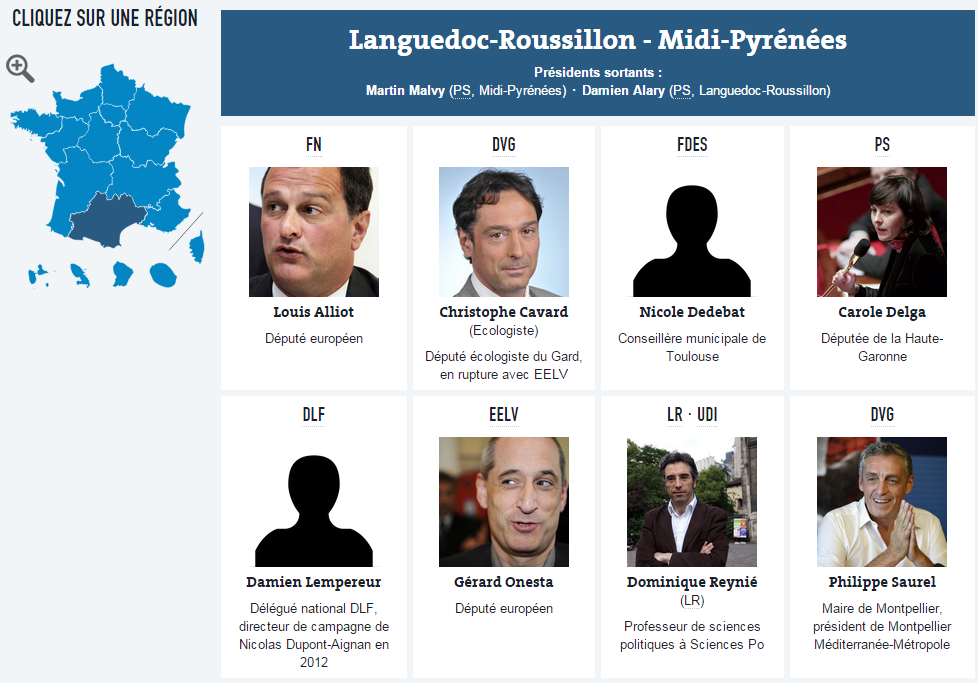

## [Bullshit bingo](bullshit-bingo) ##
Bullshit bingo pour suivre (a) les discours à l'Assemblée nationale (b) le foot (c) les soirées électorales.

[>> Discours de politique générale de Manuel Valls](http://www.lemonde.fr/les-decodeurs/visuel/2014/04/08/jouez-au-bingo-du-discours-de-politique-generale-de-manuel-valls_4397625_4355770.html)
[>> Municipales 2014](http://www.lemonde.fr/les-decodeurs/visuel/2014/03/30/suivez-la-soiree-electorale-avec-le-munibingo_4392304_4355770.html)
[>> France-Nigeria](http://www.lemonde.fr/coupe-du-monde/visuel/2014/06/30/jouez-au-bingo-du-match-france-nigeria_4448140_1616627.html)
[>> France-Equateur](http://www.lemonde.fr/les-decodeurs/visuel/2014/06/25/jouez-au-bingo-du-match-france-equateur_4445325_4355770.html)

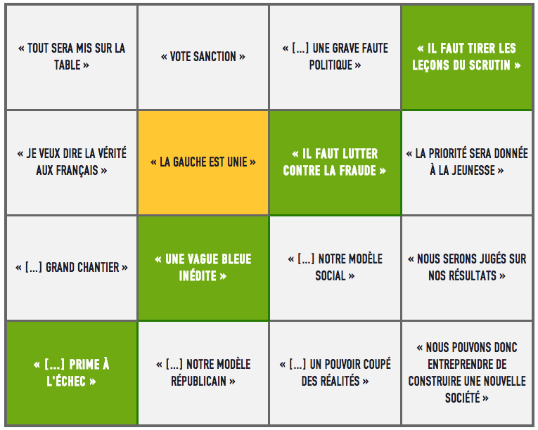

## [Baisse des charges : quel impact sur votre fiche de paie ?](calculette-fiche-de-paie)
Calculette interactive pour estimer l'impact des baisses de charge annoncées par le gouvernement en fonction de votre statut

[>> Voir Le Monde.fr](http://www.lemonde.fr/les-decodeurs/visuel/2014/04/29/baisse-des-charges-quel-impact-sur-votre-fiche-de-paie_4408955_4355770.html)

## [Jouez à composer votre carte des régions](carte-regions) ##
Carte interactive permettant de redessiner soi-même une France à 12 régions, comme le souhaitent François Hollande et Manuel Valls. La visualisation utilise la librairie [d3.js](http://d3js.org).

[>> Voir sur Le Monde.fr](http://www.lemonde.fr/les-decodeurs/visuel/2014/04/18/et-vous-comment-reduiriez-vous-la-france-a-12-regions_4403491_4355770.html)

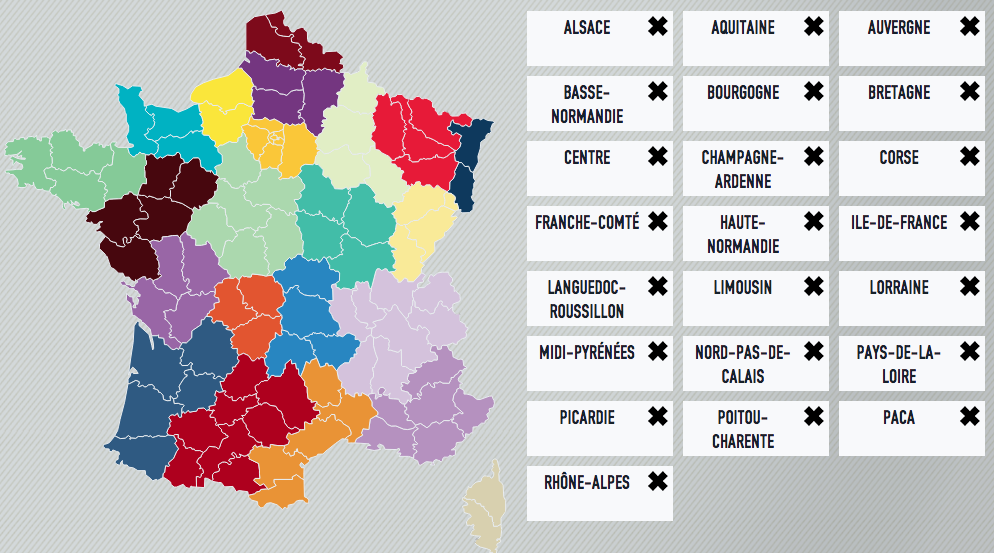

## [Xynthia et les autres : 30 ans de catastrophes naturelles en France en cartes](catastrophes-naturelles) ##
Quelles sont les régions les plus touchées par les catastrophes naturelles en France depuis 1982 ? La visualisation utilise notamment les librairies [highcharts](http://highcharts.com) et [datatables](http://datatables.net).

[>> Voir sur Le Monde.fr](http://www.lemonde.fr/les-decodeurs/visuel/2014/12/12/au-dela-de-xynthia-trente-ans-de-catastrophes-naturelles-en-cartes_4539499_4355770.html)

## [Parlement européen : comprendre le jeu surprenant des coalitions](coalitions-parlement-europeen) ##
Avant les élections européennes de mai 2014, analyse des votes au Parlement européen sur cinq grands textes emblématiques des derniers mois. La visualisation utilise la librairie [d3.js](http://d3js.org).

[>> Voir sur Le Monde.fr](http://www.lemonde.fr/les-decodeurs/visuel/2014/12/12/au-dela-de-xynthia-trente-ans-de-catastrophes-naturelles-en-cartes_4539499_4355770.html)

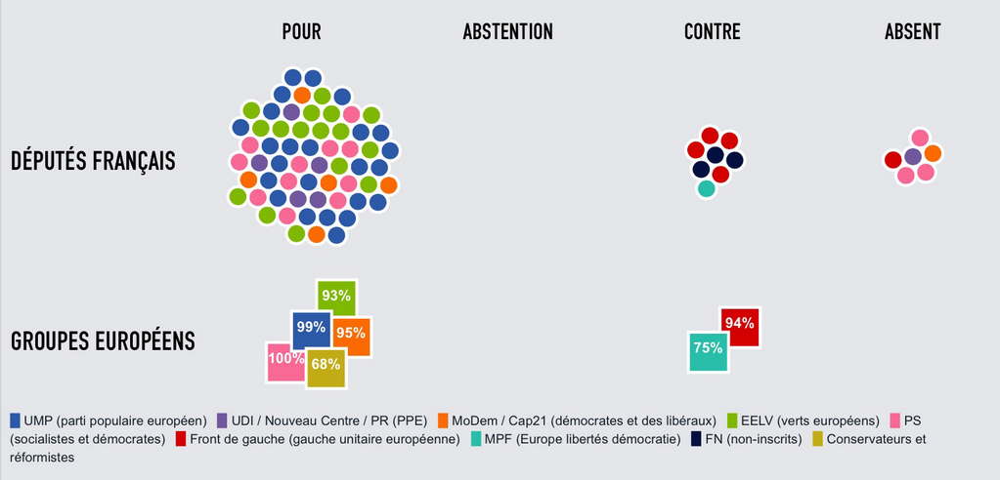

## [Municipales : allez-vous élire un futur cumulard ?](cumulards-municipales) ##
Carte de France (Google maps) des candidats aux municipales qui se retrouveraient en situation de cumul des mandats en cas d'élection aux municipales de mars 2014. Alimentée par une Google Spreadsheet (avec [Gselper](https://github.com/Pirhoo/LODP/tree/master/Gselper)), mise à jour avec les contributions des lecteurs. Moteur de recherche géré par [filter.js](https://github.com/jiren/filter.js)

[>> Voir sur Le Monde.fr](http://www.lemonde.fr/municipales/visuel/2014/02/28/municipales-allez-vous-elire-un-futur-cumulard_4368751_1828682.html)

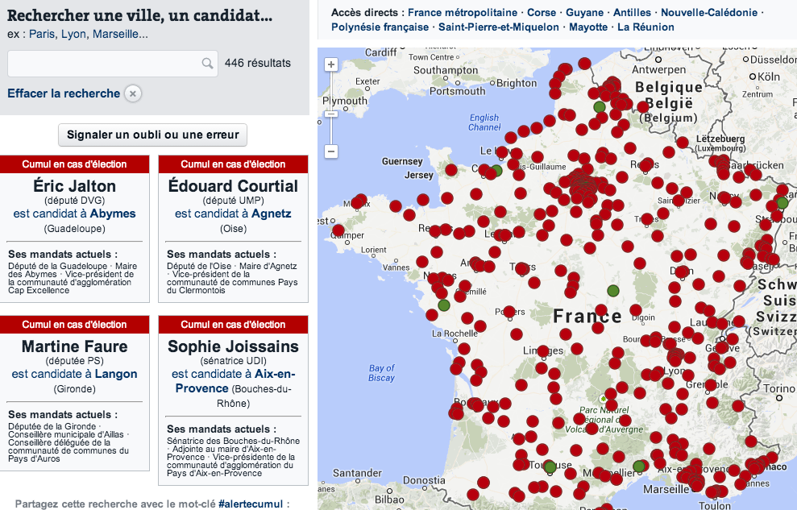

## [La domination de l'Espagne sur le football européen](foot-espagne) ##
Infographie inspirée d'un article de [Slate.fr](http://www.slate.fr/sports/87183/football-espagne-trophees-monde) montrant que l'Espagne détient les quatre principaux titres de football offerts à une nation européenne. Construite avec [d3.js](http://d3js.org) à partir du [Circular Heat Chart](https://github.com/prcweb/d3-circularheat) de [Peter Cook](https://github.com/prcweb)

>> Voir sur Le Monde.fr : [la version française](http://www.lemonde.fr/sport/visuel/2014/05/25/la-domination-de-l-espagne-sur-le-foot-europeen_4425329_3242.html) || [la version anglophone](http://www.lemonde.fr/sport/visuel/2014/05/25/la-domination-de-l-espagne-sur-le-foot-europeen_4425329_3242.html)

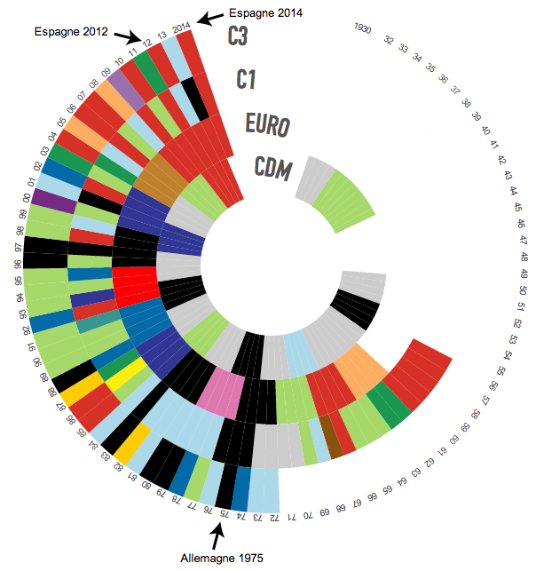

## [Coupe du monde : faites vos pronostics sur la suite de la compétition](foot-pronotics-cdm) ##
Outil de pronostics sur la Coupe du monde 2014 au Brésil avec une mise à jour quotidienne des résultats. Export du tableau avec [canvas2image.js](http://www.nihilogic.dk/labs/canvas2image/)

[>> Voir sur Le Monde.fr](http://www.lemonde.fr/les-decodeurs/visuel/2014/06/14/coupe-du-monde-faites-vos-pronostics-sur-la-suite-de-la-competition_4438319_4355770.html)

## [La valse des frondeurs au PS](frondeurs-ps) ##
Visualisation des différents votes du groupe socialiste à l'Assemblée nationale. La visualisation utilise la librairie [d3.js](http://d3js.org).

[>> Voir sur Le Monde.fr la dernière version](http://www.lemonde.fr/les-decodeurs/visuel/2014/09/16/vote-de-confiance-qu-ont-vote-les-frondeurs_4488629_4355770.html)

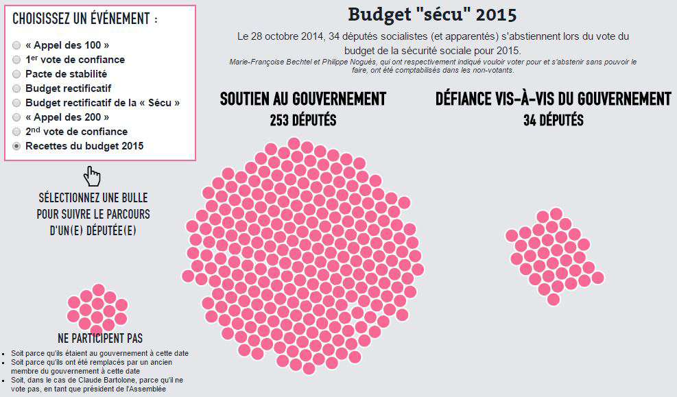

## [Comme le PS, l'UMP ou le FN, générez votre nom de parti](generateur-noms-partis) ##
Générateur simple à partir de différentes listes de mots, avec jquery.

[>> Voir sur Le Monde.fr](http://www.lemonde.fr/les-decodeurs/article/2014/10/25/comme-le-ps-l-ump-ou-le-fn-generez-votre-nom-de-parti_4512206_4355770.html)

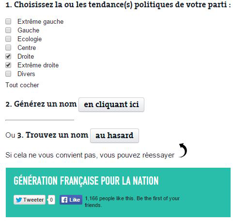

## [Le Monopoly a 80 ans : jouez avec les « Décodeurs »](monopoly) ##
Jeu conçu avec jquery.

[>> Voir sur Le Monde.fr](http://www.lemonde.fr/les-decodeurs/visuel/2015/03/07/jouez-au-monopoly-des-decodeurs_4587464_4355770.html)

## [Explorez la France qui naît et la France qui meurt](naissances-morts) ##
Utilisation de la librairie [d3.js](http://d3js.org) avec le plugin [Hexagonal Binning](https://github.com/d3/d3-plugins/tree/master/hexbin) pour créer une carte en hexagones de même taille. Les librairies [highcharts](http://highcharts.com) et [datatables](http://datatables.net) sont utilisées pour les visualisations en graphes et en tableaux.

[>> Voir sur Le Monde.fr](http://www.lemonde.fr/les-decodeurs/visuel/2014/11/13/explorez-la-france-qui-nait-et-la-france-qui-meurt_4523195_4355770.html)

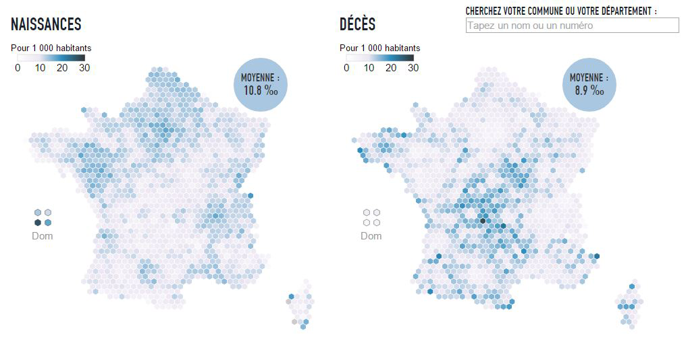

## [Le jeu dont François Hollande est le héros : comment conserver sa majorité ?](newsgame-hollande) ##
L'équation compliquée de François Hollande pour composer un nouveau gouvernement sans mettre en danger sa majorité à l'Assemblée nationale. Conçu avec jquery.

[>> Voir sur Le Monde.fr](http://www.lemonde.fr/les-decodeurs/visuel/2014/04/07/nouveau-gouvernement-aidez-francois-hollande-a-conserver-sa-majorite_4396716_4355770.html)

## [L'histoire de France racontée par le nom de ses écoles](noms-ecoles) ##
Travail à partir du fichier des 67 000 établissements du premier et du second degré fourni par le ministère de l'éducation nationale. Palmarès, carte interactive et articles.

[>> Voir l'article principal](http://www.lemonde.fr/les-decodeurs/article/2015/04/18/de-jules-ferry-a-pierre-perret-l-etonnant-palmares-des-noms-d-ecoles-de-colleges-et-de-lycees-en-france_4613091_4355770.html)
[>> Voir la carte interactive](http://www.lemonde.fr/les-decodeurs/visuel/2015/04/18/carte-le-nom-de-votre-ancienne-ecole-est-il-repandu_4617631_4355770.html)

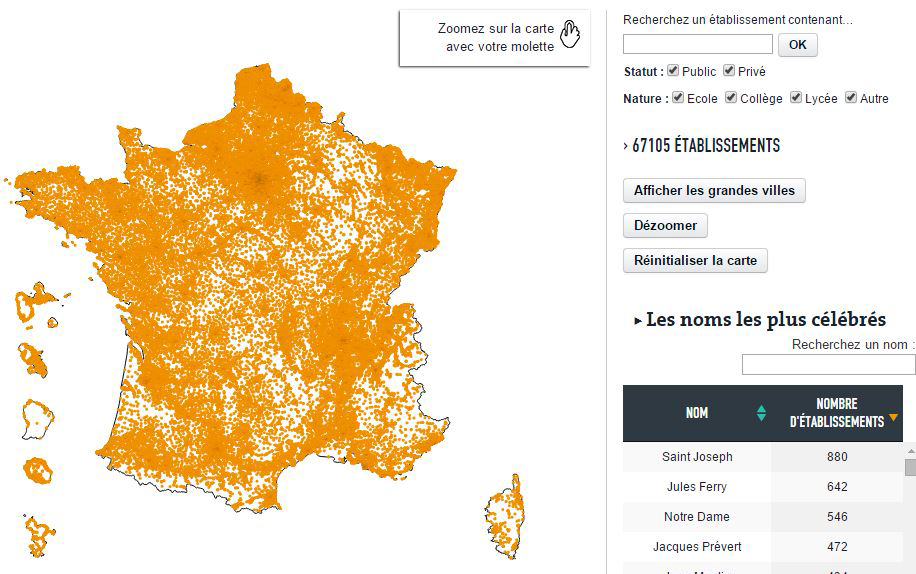

## [De la décentralisation à la crise, l'évolution des participations de l'Etat](participations-etat) ##
Visualisation des participations de l'Etat de 1994 à 2012 en accompagnement d'un article sur les [mauvais comptes de l'Etat actionnaire](http://www.lemonde.fr/les-decodeurs/article/2014/11/04/participations-les-mauvais-comptes-de-l-etat-actionnaire_4509167_4355770.html)

[>> Voir sur Le Monde.fr](http://www.lemonde.fr/les-decodeurs/visuel/2014/11/04/de-la-decentralisation-a-la-crise-l-evolution-des-participations-de-l-etat_4517740_4355770.html)

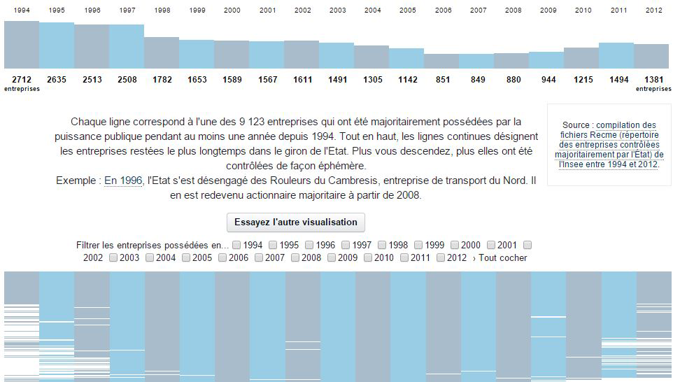

## [Littérature : les éditeurs qui raflent tous les prix](prix-litteraires) ##
Visualisation des principaux prix littéraires sur un siècle, avec un streamgraph d3.js.

[>> Voir la version 2013](http://www.lemonde.fr/livres/visuel/2013/11/30/prix-litteraires-les-maisons-d-edition-qui-regnent-sur-les-classements_3523087_3260.html)
[>> Voir la version 2014](http://www.lemonde.fr/les-decodeurs/visuel/2014/11/20/un-siecle-de-prix-litteraires-maison-par-maison_4526292_4355770.html)

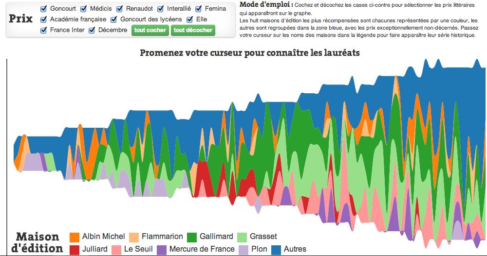

## [Européennes : tous les partis pensent-ils pareil ?](programmes-europeennes-2014) ##
Visualisation des principales propositions des grands partis pour les élections européennes de mai 2014. La visualisation utilise la librairie [d3.js](http://d3js.org).

[>> Voir sur Le Monde.fr](http://www.lemonde.fr/les-decodeurs/visuel/2014/05/15/europeennes-tous-les-partis-pensent-ils-pareil_4419636_4355770.html)

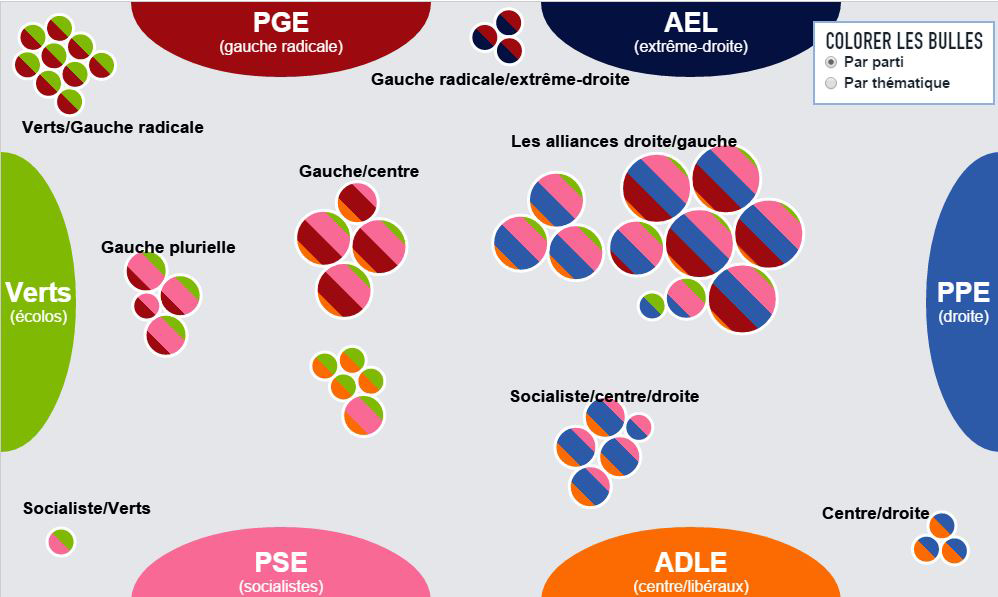